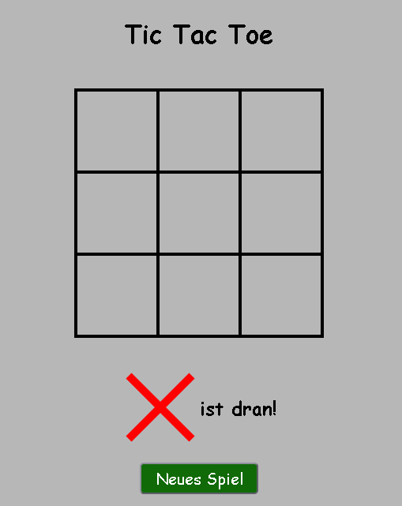
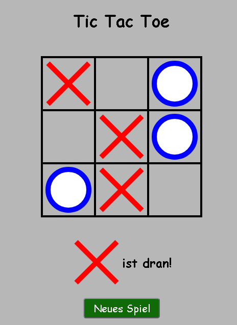
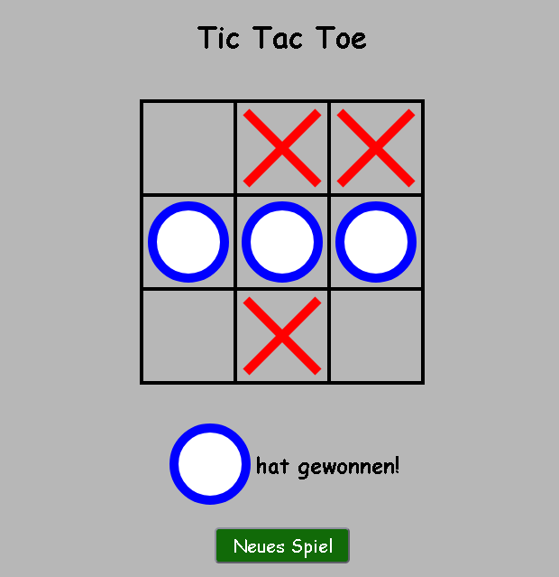

# ❌⭕ Tic Tac Toe – Web App  

Ein klassisches **Tic Tac Toe**-Spiel, programmiert mit **HTML5, CSS3 und JavaScript**.  
Die App läuft direkt im Browser und erlaubt es zwei Spieler:innen, gegeneinander anzutreten.  

---

## 🚀 Features  
- Spielfeld mit 3×3 Feldern  
- Abwechselnde Spielzüge (X und O)  
- Gewinn- und Unentschieden-Erkennung  
- Reset-Funktion zum Neustarten des Spiels  
- Minimalistisches, responsives Design  

---

## 🛠️ Technologien  
- HTML5  
- CSS3  
- JavaScript  

---

## 📦 Installation & Nutzung  
1. Repository klonen oder herunterladen  
2. Projektordner öffnen  
3. `index.html` im Browser starten  
   👉 Das Spiel läuft direkt lokal, kein Server erforderlich.  

---

## 🖼️ Screenshots   

---

## 📄 Hinweis  
Dieses Projekt ist ein **Lern- und Demonstrationsprojekt** und zeigt die Umsetzung eines Klassikers mit reinen Web-Technologien.  

---

## 👤 Autor  
**[Yvan Zambou]**  

  
  

---
